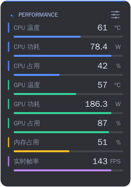
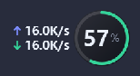
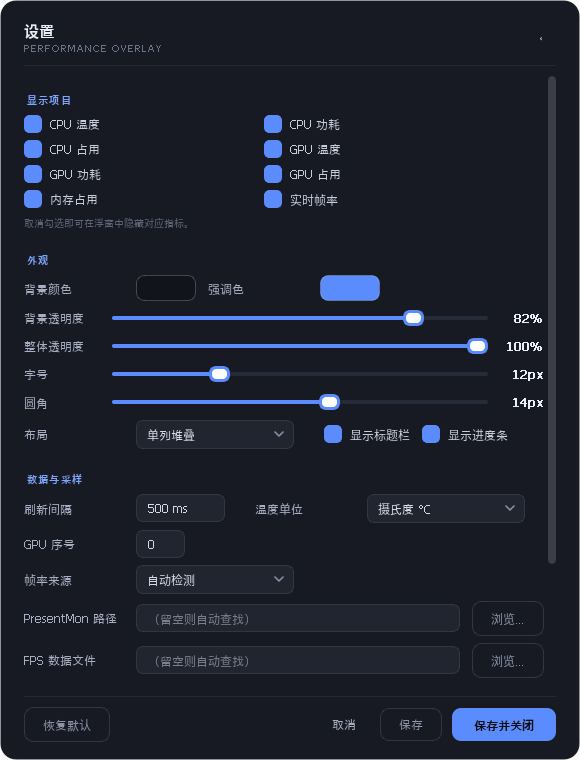

# PerformanceMonitor

> 轻量、置顶、可自由拖动的桌面性能 HUD——用一个小浮窗实时看懂你的电脑。


---

## 简介

游戏帧数忽高忽低时，你不知道是 CPU 过热降频、显存爆了还是内存吃满——切出游戏开任务管理器又打断操作。PerformanceMonitor 用一个半透明小浮窗解决：**始终悬浮在游戏之上**，8 项关键指标实时可见，一眼定位瓶颈。

### 核心特性

- **8 项实时指标**：CPU 温度 / 功耗 / 占用率，GPU 温度 / 功耗 / 占用率，内存占用率，实时帧率
- **内存圆盘模式**：只勾选内存时，浮窗变成 PC 管家风格的圆形仪表盘
- **悬停看网速**：鼠标停在内存圆盘上，旁边显示实时上行 / 下行速度（↑蓝 ↓绿、无边框、紧贴圆环，如 `16.0K/s`），移开即恢复原样
- **一键内存加速**：点击圆盘中心，安全释放所有进程的工作集内存（同样的手法 RAMMap / 电脑管家在用），带加速动画和释放量报告
- **游戏不怕挡**：Qt 置顶 + Win32 `HWND_TOPMOST` + WinEvent 钩子三重保证，始终压在无边框全屏游戏之上
- **逐项开关、深度自定义**：每个指标独立开关；背景 / 强调 / 文字 / 标签四种颜色、两档透明度、字号、圆角、布局全部可调，设置实时预览
- **开箱即用**：打包版内嵌 LibreHardwareMonitor 与 Intel PresentMon，不需要安装额外软件
- **优雅降级**：任何传感器缺失只显示 `--`，绝不影响其它指标

### 适用场景

- ✅ 边框窗口化 / 无边框全屏游戏中实时监控
- ✅ 长时间渲染 / 编译时盯温度和功耗
- ✅ 想随时释放内存、查看网速
- ❌ **独占全屏（Exclusive Fullscreen）游戏**——该模式会覆盖一切普通窗口，请把游戏改为无边框窗口化
- ❌ macOS——未适配

### 效果预览

| 主界面（矩形） | 圆盘模式 + 悬停网速 |
| --- | --- |
|  |  |

| 设置界面 | 打包版运行效果 |
| --- | --- |
|  |  |

---

## 快速开始

### 方式一：下载 exe 直接用（推荐）

从 [Releases](https://github.com/yan6476572/PerforMonitor/releases) 下载 `PerformanceMonitor.exe`（或用本仓库源码自行打包），**双击即可运行，无需安装 Python**。

首次启动会弹 UAC 提权确认——这是读取 CPU 温度 / 功耗所必需的（传感器需要 MSR 内核驱动访问权限）。想跳过请用 `--no-elevate` 参数启动，此时 CPU 温度 / 功耗显示 `--`，其余功能不受影响。

### 方式二：从源码运行

**环境要求**：Windows 10/11（Linux 部分功能可用）、Python 3.9 – 3.13

```bash
git clone https://github.com/yan6476572/PerforMonitor.git
cd PerforMonitor

python -m venv .venv
# Windows
.venv\Scripts\activate
# Linux
source .venv/bin/activate

pip install -r requirements.txt
python main.py
```

看到浮窗出现即安装成功。

### 常用命令行参数

```bash
python main.py --settings        # 启动时直接打开设置
python main.py --hidden          # 启动后隐藏浮窗（仅托盘）
python main.py --no-elevate      # 不请求管理员权限
python main.py --config PATH     # 指定配置文件路径
python main.py --screenshot DIR  # 导出界面截图后退出（诊断用）
python main.py --reset           # 恢复默认设置
python main.py --version         # 查看版本
python main.py --autostart-status  # 查询开机自启是否已注册
```

---

## 使用说明

| 操作 | 效果 |
| --- | --- |
| 拖动浮窗任意位置 | 移动（可在菜单里锁定位置） |
| 拖动边缘 / 四角 | 调整大小，光标自动变成方向箭头 |
| 双击标题栏 / 点击右上角 ⛭ | 打开设置 |
| 右键浮窗 | 菜单：设置、锁定、置顶、鼠标穿透、复制数据、退出 |
| **单击内存圆盘中心**（圆盘模式） | 一键内存加速 |
| **鼠标悬停内存圆盘**（圆盘模式） | 显示实时上行 / 下行网速 |
| 单击 / 双击托盘图标 | 显示隐藏浮窗 / 打开设置 |

### 设置面板

- **显示项目**：8 个指标逐个开关，取消即隐藏、布局自动重排
- **外观**：背景色、强调色、文字色、标签色、背景透明度（不动文字）、整体透明度、字号（9–20）、圆角（0–24）、单列 / 双列布局、标题栏与进度条开关
- **数据与采样**：刷新间隔（100–5000 ms）、温度单位 °C/°F、GPU 序号（多显卡）、帧率来源（自动检测 / PresentMon / 数据文件 / 关闭）
- **窗口**：锁定位置、鼠标穿透（游戏时不挡操作，从托盘恢复）、开机自启动（走任务计划程序注册，登录即启、不弹 UAC）

> 设置**实时预览**：任何改动立即生效，「取消」整体回滚，「保存」写入配置。

---

## 数据来源

| 指标 | Windows | Linux |
| --- | --- | --- |
| CPU / 内存占用率、网速 | `psutil` | `psutil` |
| CPU 温度 / 功耗 | 内嵌 LibreHardwareMonitorLib（pythonnet 进程内加载）→ WMI 桥 → ACPI 热区 | `psutil.sensors_temperatures`；功耗走 RAPL |
| GPU 温度 / 功耗 / 占用 | NVIDIA NVML（装好驱动即可）；无 NVML 时走 LibreHardwareMonitor | NVML；AMD 读 `amdgpu` sysfs |
| 实时帧率 | 内嵌 Intel PresentMon（按前台进程统计，支持 DX11/12、Vulkan、OpenGL、UWP） | 数据文件（如 MangoHud `output_file`） |

优先级与细节：

- 打包版已内置 LibreHardwareMonitor 与 PresentMon，**无需额外安装**；从源码运行时若检测到 `LibreHardwareMonitor.NET.10/` 目录同样自动加载
- 帧率来源选「数据文件」时，任何工具往文本文件写数字都行。Linux 上配合 MangoHud：
  ```bash
  MANGOHUD_CONFIG="output_folder=/tmp/mh,output_file=fps.txt" mangohud %command%
  ```
  然后把帧率来源设为「数据文件」，路径填 `/tmp/mh/fps.txt`
- **某个传感器读不到时显示 `--`，其余指标照常工作**——任何单项缺失都不会影响其它功能

---

## 配置

配置为 JSON 文件，修改后重启生效（推荐直接在设置面板改，实时生效）：

| 系统 | 路径 |
| --- | --- |
| Windows | `%APPDATA%\PerformanceMonitor\settings.json` |
| Linux | `~/.config/PerformanceMonitor/settings.json` |
| macOS | `~/Library/Application Support/PerformanceMonitor/settings.json` |

- 可用 `--config` 指定任意路径，或设环境变量 `PERF_OVERLAY_CONFIG`
- 旧版本目录名 `PerfOverlay` 若存在会自动兼容
- 浮窗位置、大小、全部设置项均自动持久化，重启还原

---

## 开发

```bash
# 克隆 + 环境（见「快速开始」）之后：

# 用假数据渲染 UI 截图（无需真实传感器）
QT_QPA_PLATFORM=offscreen python tools/preview.py

# 功能自测：拖动 / 边缘缩放 / 逐项开关 / 设置持久化 / 置顶 / 穿透
QT_QPA_PLATFORM=offscreen python tools/selftest.py

# 网速悬停卡片自测（15 项断言 + 截图输出到 build/test_net_hover/）
python tools/test_net_hover.py
```

### 项目结构

```
perf_overlay/
├── app.py                  # 启动引导：浮窗 + 传感器 + 托盘 + UAC 提权
├── metrics.py              # 指标定义（传感器层与 UI 的唯一契约）
├── config.py               # 设置模型与 JSON 持久化
├── boost.py                # 一键内存加速（EmptyWorkingSet 修剪工作集）
├── autostart.py            # 开机自启（任务计划程序，免 UAC）
├── platform_win.py         # Win32 置顶 / 穿透 / 全屏置顶守卫
├── sensors/
│   ├── system.py           # psutil + LibreHardwareMonitor + RAPL + amdgpu
│   ├── lhm_net.py          # pythonnet 加载 LibreHardwareMonitorLib.dll
│   ├── nvidia.py           # NVML
│   ├── fps.py              # PresentMon / 数据文件帧率
│   └── manager.py          # 后台轮询线程
└── ui/
    ├── overlay.py          # 浮窗：绘制 / 圆盘 / 加速动画 / 拖动缩放 / 菜单
    ├── net_card.py         # 内存圆盘悬停网速卡片
    ├── settings.py         # 设置面板（实时预览）
    └── theme.py            # 配色、字体、QSS
```

### 打包 exe

```bash
# 一键打包（自动建环境、装依赖、打包）
build_exe.bat

# 或手动
pip install pyinstaller
pyinstaller PerfOverlay.spec
# 产物：dist/PerformanceMonitor.exe（单文件、UPX 压缩、requireAdministrator、自定义图标）
```

自定义图标 / 单文件与目录版 / 杀软误报处理等详见 [`docs/BUILD-WINDOWS.md`](docs/BUILD-WINDOWS.md)。

---

## 更新日志

- **2026-10-05**：新增内存圆盘悬停网速卡片（↑蓝上行 / ↓绿下行；无边框、两行紧贴、紧靠圆环）；更换应用图标；重写 README
- **2026-10-01**：应用图标重制
- **2026-09-25**：首个公开版本——8 项指标、圆盘模式、一键加速、托盘、设置面板、打包脚本

---

## 常见问题

**Q：游戏里看不到浮窗？**
独占全屏会覆盖所有普通窗口。把游戏设为 **无边框窗口化** 即可正常显示。

**Q：为什么启动时弹 UAC（管理员确认）？**
读取 CPU 温度 / 功耗需要 LibreHardwareMonitor 内核驱动访问 MSR 寄存器，这要求管理员权限。点「否」或用 `--no-elevate` 启动也能运行，只是 CPU 温度 / 功耗显示 `--`。

**Q：某个指标显示 `--`？**
对应传感器当前不可用：CPU 温度 / 功耗需要管理员权限（提权后自动恢复）；GPU 需要 NVIDIA 驱动（或 AMD + amdgpu）；帧率需要 PresentMon 或数据文件。单项缺失不影响其它指标。

**Q：一键加速会杀进程 / 删文件吗？**
不会。它只调用 `EmptyWorkingSet` 把闲置内存页换出物理内存（RAMMap「清空工作集」同一手法），不结束任何进程、不删任何文件，释放量按实际修剪的工作集统计并在圆盘上汇报。

**Q：配置文件在哪里？**
见「配置」一节；找不到时用 `--config` 显式指定。

**Q：CPU 占用高吗？**
不高。传感器轮询在独立线程，默认 500 ms 一次，单次耗时通常 < 5 ms。

**Q：杀毒软件报毒？**
PyInstaller 单文件 exe 的常见误报。可用 `build_exe.bat` 在本机自行打包，或把文件加入白名单。

---

## License

[MIT](LICENSE) —— 可自由使用、修改、商用，保留版权声明即可。

## 致谢

- [LibreHardwareMonitor](https://github.com/LibreHardwareMonitor/LibreHardwareMonitor) —— CPU / GPU 传感器
- [Intel PresentMon](https://github.com/GameTechDev/PresentMon) —— 帧率采集
- [PySide6](https://www.qt.io/qt-for-python) / [psutil](https://github.com/giampaolo/psutil) / [pythonnet](https://github.com/pythonnet/pythonnet)
